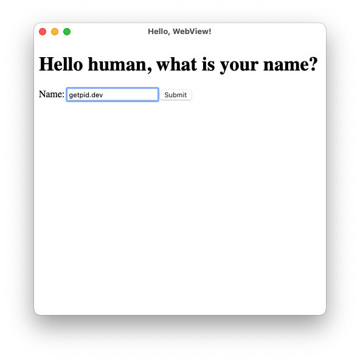
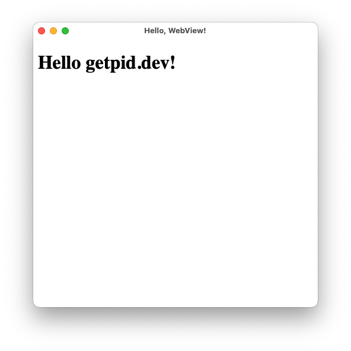
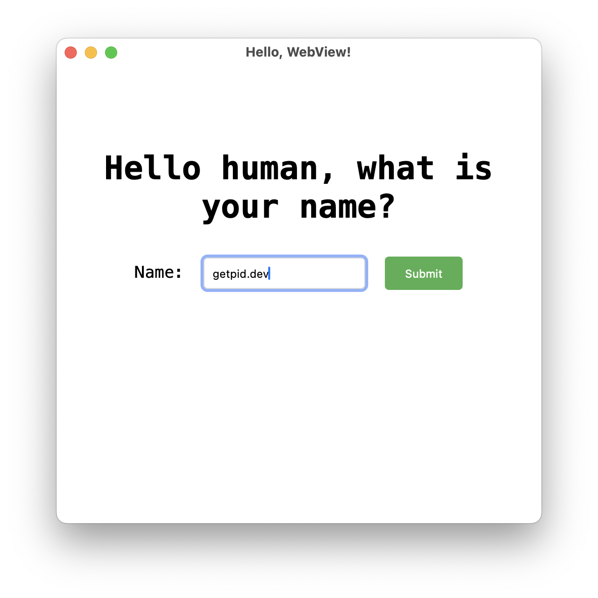
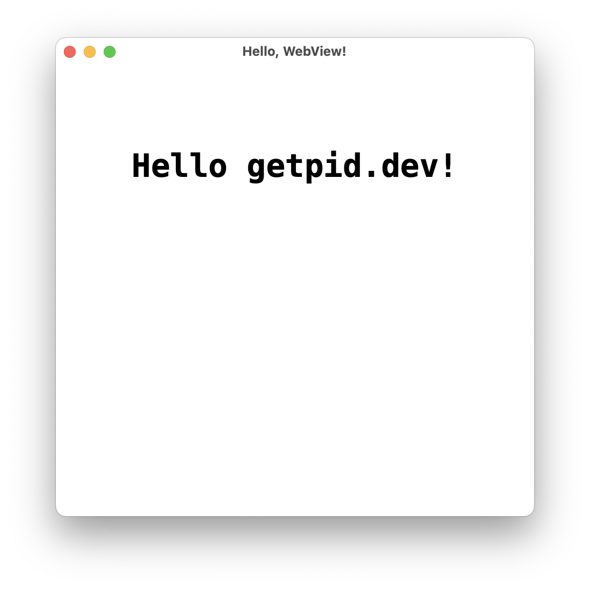

Today we will learn how to build a cross-platform GUI with [Webview](https://github.com/webview/webview) using its [Go bindings](https://github.com/webview/webview_go) and how to package it all into a single executable for easier distribution.

Webview launches a new window that uses the rendering engine of a browser already present on the system to show HTML and run JavaScript. This can be a nice alternative to bulky Electron apps, while still allowing you to build beautiful applications using web technologies.

If you take a look at the [library itself](https://pkg.go.dev/github.com/webview/webview_go),
it has a very small footprint, offering basic window creation and operations like destroying the window, setting its size, setting HTML and JavaScript, and navigating to a page. We will use the latter.

## Architecture

The application architecture will be simple:


There will be a web server that will do all the heavy lifting.
We will do server-side rendering using HTML templates and try to avoid JavaScript as much as possible. We will use plain HTML forms, and the web server will be responsible for all the logic. Also, it will serve us assets, like CSS and images.

The Webview itself will be just a view. No Electron required.

## Showing the window

Starting up with Webview is pretty simple. Here's the code to run a new window
with a title and specific size:

```go
w := webview.New(false)
defer w.Destroy()

w.SetTitle("Hello, WebView!")
w.SetSize(480, 480, webview.HintNone)
w.Run()

```



```go
package main

import (
    webview "github.com/webview/webview_go"
)

func main() {
    w := webview.New(false)
    defer w.Destroy()

    w.SetTitle("Hello, WebView!")
    w.SetSize(480, 480, webview.HintNone)
    w.Run()
}

```



`go run ./webserver.go` and here's what it looks like:


Pretty neat, huh?

## Serving the HTML

Now, let's serve our first page. For this, we will need to have
an HTTP server (let's call it a web server) that will give us content and instruct Webview to navigate to our web server.

Usually, when you run an HTTP server, you specify the port on which it will run.
We could choose a random port number, hoping the port is not already taken on the host's system. Instead, we will let the system choose one for us.

First, we will create a TCP listener that will bind to any port on localhost:

```go
// port 0 means port will be automatically chosen
listener, err := net.Listen("tcp4", "127.0.0.1:0")
```

And give the listener to the HTTP server:

```go
srv := http.Server{...}
srv.Serve(listener)
```

Then, instruct the Webview window to navigate to the server's address:

```go
w.Navigate("http://" + u.String())
```

Putting it all together, we are ready to serve our first page:



```go
package main

import (
    "errors"
    "log/slog"
    "net"
    "net/http"
    "os"

    webview "github.com/webview/webview_go"
)

func main() {
    listener, err := net.Listen("tcp4", "127.0.0.1:0")
    if err != nil {
        slog.Error("listen on TCP", "error", err)
        os.Exit(1)
    }

    mux := http.NewServeMux()
    mux.HandleFunc("/", func(w http.ResponseWriter, r *http.Request) {
        w.Write([]byte("Hello, WebView!\n"))
    })
    srv := http.Server{
        Handler: mux,
    }

    go func() {
        if err := srv.Serve(listener); err != nil {
            if !errors.Is(err, http.ErrServerClosed) {
                slog.Error("server error", "error", err)
                os.Exit(1)
            }
        }
    }()

    w := webview.New(false)
    defer w.Destroy()

    w.SetTitle("Hello, WebView!")
    w.SetSize(480, 480, webview.HintNone)
    w.Navigate("http://" + listener.Addr().String())
    w.Run()
}

```




Easy as this, you now have your first HTML served in Webview!

## Interactivity

Let's add some interactivity to our page: a form and a button! We'll ask the user for a name to greet them.
We will define two HTML pages: one with a form asking for a name and another with a greeting.
Here is the simple HTML we will use. The first is a form:



```html
<!DOCTYPE html>
<html lang="en">

<body>
    <h1>Hello human, what is your name?</h1>
    <form id="nameForm" action="/greet" method="post">
        <label for="name">Name:</label>
        <input type="text" id="name" name="name" placeholder="Enter your name" required>

        <button type="submit">Submit</button>
    </form>
</body>

</html>
```



And the second is a Go [template/html](https://pkg.go.dev/html/template) for adding the name of the person to greet:



```html
<!DOCTYPE html>
<html lang="en">

<body>
    <h1>Hello {{.name}}!</h1>
</body>

</html>
```




Because we want our package to be self-contained, we will embed our templates into an [embeddable file system](https://pkg.go.dev/embed#FS). If we put all our templates under the `templates` folder, we can do the following:

```go
//go:embed templates/*
var templates embed.FS
```

Now that our templates are safely embedded, we can parse them and serve them:

```go
tmpl, err := template.ParseFS(templates, "templates/*.html")
...

mux := http.NewServeMux()
mux.HandleFunc("/", func(w http.ResponseWriter, r *http.Request) {
    tmpl.ExecuteTemplate(w, "index.html", nil)
})
mux.HandleFunc("/greet", func(w http.ResponseWriter, r *http.Request) {
    if err := r.ParseForm(); err != nil {
        http.Error(w, fmt.Sprintf("whoopsies: %s", err), http.StatusInternalServerError)
        return
    }

    name := r.FormValue("name")
    data := map[string]string{"name": name}
    tmpl.ExecuteTemplate(w, "greeting.html", data)
})
```



```go
package main

import (
    "embed"
    "errors"
    "fmt"
    "html/template"
    "log/slog"
    "net"
    "net/http"
    "os"

    webview "github.com/webview/webview_go"
)

//go:embed templates/*
var templates embed.FS

func main() {
    listener, err := net.Listen("tcp4", "127.0.0.1:0")
    if err != nil {
        slog.Error("listen on TCP", "error", err)
        os.Exit(1)
    }

    tmpl, err := template.ParseFS(templates, "templates/*.html")
    if err != nil {
        slog.Error("parse templates", "error", err)
        os.Exit(1)
    }

    mux := http.NewServeMux()
    mux.HandleFunc("/", func(w http.ResponseWriter, r *http.Request) {
        tmpl.ExecuteTemplate(w, "index.html", nil)
    })
    mux.HandleFunc("/greet", func(w http.ResponseWriter, r *http.Request) {
        if err := r.ParseForm(); err != nil {
            http.Error(w, fmt.Sprintf("whoopsies: %s", err), http.StatusInternalServerError)
            return
        }

        name := r.FormValue("name")
        data := map[string]string{"name": name}
        tmpl.ExecuteTemplate(w, "greeting.html", data)
    })

    srv := http.Server{
        Handler: mux,
    }

    go func() {
        if err := srv.Serve(listener); err != nil {
            if !errors.Is(err, http.ErrServerClosed) {
                slog.Error("server error", "error", err)
                os.Exit(1)
            }
        }
    }()

    w := webview.New(true)
    defer w.Destroy()

    w.SetTitle("Hello, WebView!")
    w.SetSize(480, 480, webview.HintNone)
    w.Navigate("http://" + listener.Addr().String())
    w.Run()
}
```



Give it a quick try:









## Glamour

Let's learn how to serve static files. We will serve CSS to add some beauty 💅 to the pages.

Create a file `style.css` in the `static` folder and add some CSS magic:



```css
body {
    font-family: Consolas, monospace;
    margin: 40px auto;
    padding: 20px;
    text-align: center;
}

input {
    padding: 8px;
    margin: 10px;
    border-radius: 4px;
    border: 1px solid #ddd;
}

button {
    background-color: #4CAF50;
    color: white;
    padding: 10px 20px;
    border: none;
    border-radius: 4px;
    cursor: pointer;
}
```



Now, embed all files in the `static` folder:

```go
//go:embed static/*
var static embed.FS
```

And serve them:

```go
mux.Handle("/static/", http.FileServerFS(static))
```

The final step is to link this CSS in your HTML. Add the following lines to your HTML files in the `templates` directory, right after the opening `<html>` tag:

```html
<head>
    <link rel="stylesheet" href="/static/style.css">
</head>
```

Run the web server again and see how it shines! ✨









You can use the same technique to serve images, JavaScript, or anything else you'd like.

## Cross-compiling for Windows

To cross-compile your application for Windows from Linux or macOS, you will need [mingw-w64](https://www.mingw-w64.org/).

For various Linux distributions, refer to the link above for installation instructions. For example, instructions for [Debian/Ubuntu are available here](https://www.mingw-w64.org/getting-started/debian/).

On macOS, you can install it using Homebrew:

```sh
brew install mingw-w64
```

### Building

To build the application, you need to enable CGO and provide the correct flags to the compiler. Here’s the command that works for me:

```sh
GOOS=windows GOARCH=amd64 CGO_ENABLED=1 CC=x86_64-w64-mingw32-gcc CXX=x86_64-w64-mingw32-g++ \
    go build -ldflags "-H windowsgui" -v -o webview.exe ./webview.go
```

## Recap

In this guide, we've learned how to build a simple Webview application that uses a local web server to render pages and serve static files.

Now, go and explore the endless possibilities that Webview offers.
